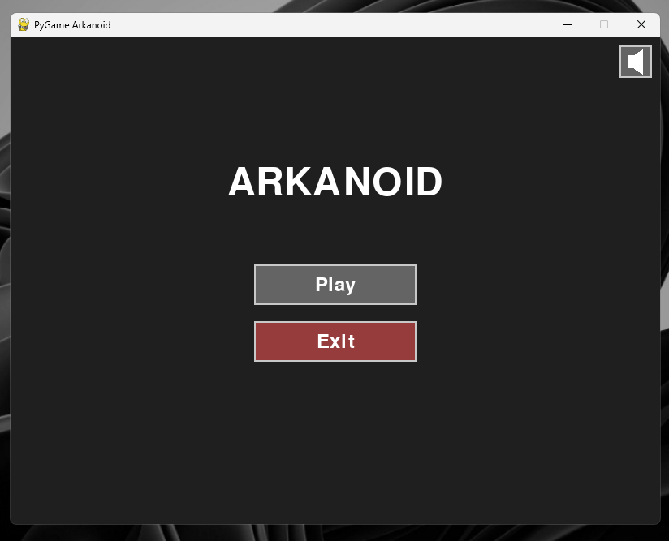
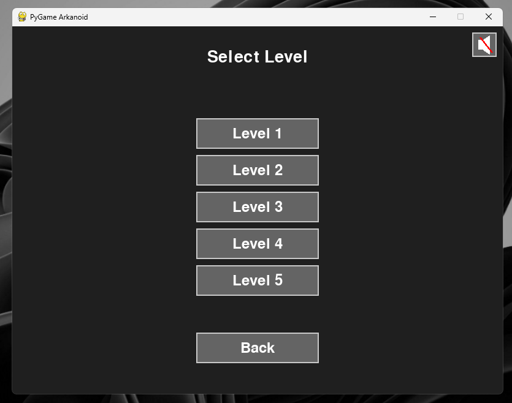
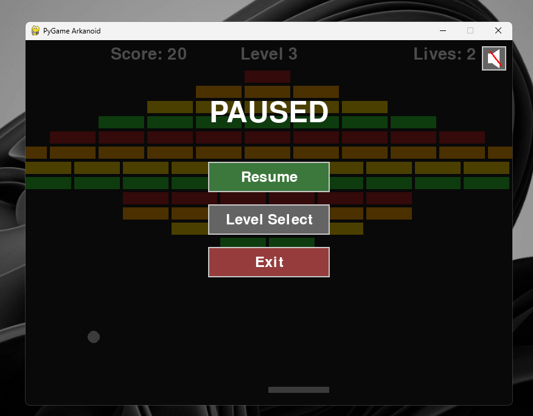

# Arkanoid Game



This is my enchanced version of the classic Arkanoid game, built with **Python** and **Pygame**.  

---

## How to Run

### Requirements:

- Python 3
- Git

### Setup Instructions:

1. Clone the repository:
   ```bash
   git clone https://github.com/wannadiexd/python-arkanoid
   cd python-arkanoid
   ```

2. (Linux/macOS) Run:
    ```bash
    sh install.sh
    ```
    Or install manually:
    ```bash
    python3 -m venv env
    source env/bin/activate
    pip install -r requirements.txt
    ```
3. Go to the directory:
    ```bash
    cd final_version
    ```
4. Launch the game:
    ```bash
    python3 main.py
    ```
---

## What I Added/Improved

### Power-Ups

I added five new power-ups to make the gameplay more dynamic:

* Multi Ball – Spawns extra balls

* Extra Life – Adds one life

* Strong Ball – Breaks bricks without bouncing

* Fast Ball – Doubles ball speed (negative effect)

* Shrink Paddle – Reduces paddle size (negative effect)

### Code Improvements

* Refactored the Ball and Paddle classes for power-up handling

* Fixed bugs in ball-brick collision

* Improved game state save/restore

* Added support for multiple active balls

### Gameplay & Balance

* Power-ups apply to all active balls

    * Duration tuning:

        - Strong Ball: 15s

        - Fast/Shrink: 10s / 7.5s

    * Sounds play per power-up

    * Losing the main ball doesn’t end the game if others are active

### UI Additions

* Mute sound button

* Exit button

* Game over effects

* Pause menu with resume

* Level indicator

* Game state is saved during pause

## Some screenshots of game:




